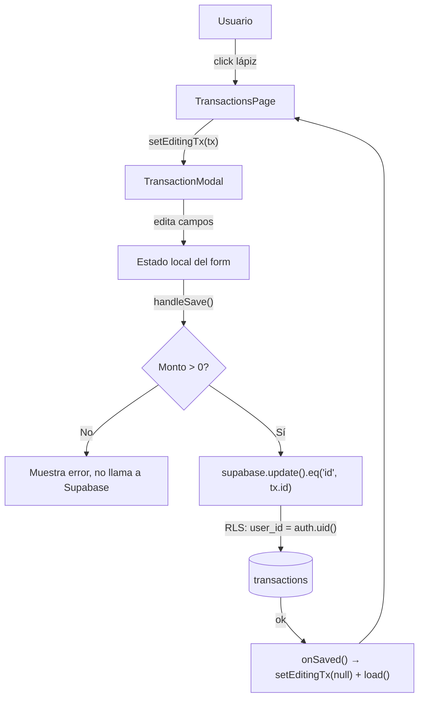
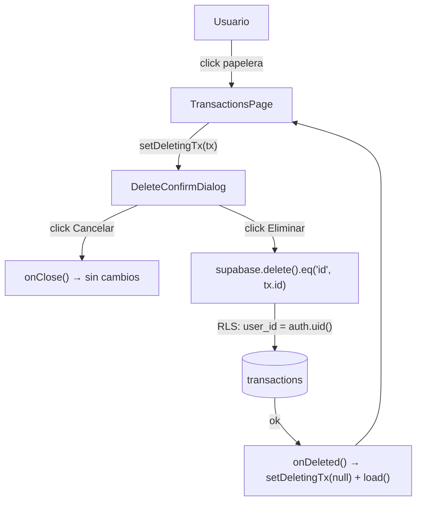
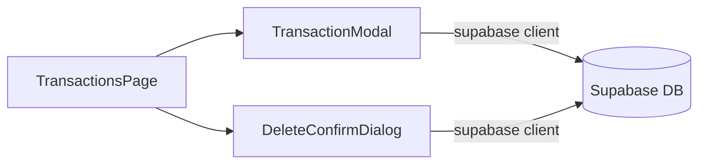

# Feature: Edición y eliminación de transacciones desde la web

**Fecha:** 2026-04-03
**Tipo:** Feature
**Estado:** Verificado por qa-engineer ✅

---

## 1. Descripción del feature

Hasta este momento la tabla de movimientos en la sección **Movimientos** (`/transactions`) era completamente de solo lectura. El usuario podía ver sus transacciones registradas (principalmente vía WhatsApp), pero no tenía ninguna forma de corregirlas o eliminarlas desde el dashboard web.

Esta limitación se resolvió añadiendo una columna **Acciones** al final de la tabla, con dos botones por fila: un ícono de lápiz para editar y un ícono de papelera para eliminar. Al pulsar editar se abre un modal con los cinco campos editables pre-rellenos con los valores actuales de la transacción. Al pulsar eliminar se muestra un diálogo de confirmación antes de ejecutar la operación.

La solución es exclusivamente del lado del frontend. La base de datos ya contaba con políticas RLS de `UPDATE` y `DELETE` scoped por `user_id = auth.uid()`, y el grant `authenticated` ya tenía permisos sobre la tabla `transactions`, por lo que no se requirió ninguna migración ni endpoint nuevo en el API.

---

## 2. Archivos implementados

### `app/src/components/TransactionModal.tsx`
**Acción:** Creado

Modal de edición de una transacción existente. Recibe la transacción a editar y la lista de categorías disponibles. Inicializa cada campo de formulario con los valores actuales de la transacción e invoca `supabase.update()` al guardar.

Campos editables:
- **Tipo** (`type`) — `<select>` con opciones `expense` / `income`
- **Monto** (`amount`) — `<input type="number">` con validación `> 0` antes de llamar a Supabase
- **Descripción** (`description`) — `<input type="text">`, se guarda como `null` si queda vacío
- **Categoría** (`category_id`) — `<select>` poblado con las categorías ya cargadas en la página; permite "Sin categoría"
- **Fecha y hora** (`occurred_at`) — `<input type="datetime-local">` con conversión local→ISO al guardar

Detalle de la lógica de guardado:

```tsx
async function handleSave() {
  const parsedAmount = parseFloat(amount)
  if (isNaN(parsedAmount) || parsedAmount <= 0) {
    setError('El monto debe ser mayor a 0.')
    return
  }

  const { error: supabaseError } = await supabase
    .from('transactions')
    .update({
      type,
      amount: parsedAmount,
      description: description.trim() || null,
      category_id: categoryId || null,
      occurred_at: new Date(occurredAt).toISOString(),
      category_overridden: categoryId !== transaction.category_id,
    })
    .eq('id', transaction.id)

  if (supabaseError) {
    setError('Error al guardar. Intenta de nuevo.')
    return
  }

  onSaved()
}
```

El campo `category_overridden` se actualiza automáticamente a `true` cuando el usuario cambia la categoría, marcando que la clasificación original de la IA fue sobreescrita manualmente.

La conversión de fecha usa una función local `toLocalDatetimeInput` que convierte el ISO UTC de la DB al formato `YYYY-MM-DDTHH:mm` esperado por el input HTML, respetando la zona horaria local del navegador:

```tsx
function toLocalDatetimeInput(iso: string) {
  const d = new Date(iso)
  const pad = (n: number) => String(n).padStart(2, '0')
  return `${d.getFullYear()}-${pad(d.getMonth() + 1)}-${pad(d.getDate())}T${pad(d.getHours())}:${pad(d.getMinutes())}`
}
```

---

### `app/src/components/DeleteConfirmDialog.tsx`
**Acción:** Creado

Diálogo de confirmación antes de eliminar una transacción. Muestra el nombre de la transacción (`description` o `raw_user_text` como fallback) para que el usuario identifique claramente qué va a borrar. Sólo ejecuta `supabase.delete()` tras confirmación explícita.

```tsx
const label =
  transaction.description ?? transaction.raw_user_text ?? 'este movimiento'

async function handleDelete() {
  const { error: supabaseError } = await supabase
    .from('transactions')
    .delete()
    .eq('id', transaction.id)

  if (supabaseError) {
    setError('Error al eliminar. Intenta de nuevo.')
    return
  }

  onDeleted()
}
```

Ambos botones del diálogo ("Cancelar" / "Eliminar") tienen estados de carga y manejo de errores de Supabase.

---

### `app/src/pages/TransactionsPage.tsx`
**Acción:** Modificado

Cambios principales respecto a la versión anterior:

1. **`load` extraído a `useCallback`** — necesario para poder ser llamado como función directa tras guardar o eliminar (en lugar de depender solo del efecto de cambio de `page`/`typeFilter`).

2. **Estado para modales** — dos nuevas variables de estado:
   ```tsx
   const [editingTx, setEditingTx] = useState<(Transaction & { category_name?: string }) | null>(null)
   const [deletingTx, setDeletingTx] = useState<Transaction | null>(null)
   ```

3. **Categorías en estado** — las categorías cargadas en `load` ahora se guardan en `useState<Category[]>` para pasarlas al `TransactionModal` sin re-fetch.

4. **Columna "Acciones"** — nueva `<th>` y dos botones de ícono SVG por cada `<tr>`:
   ```tsx
   <td className="px-4 py-3">
     <div className="flex items-center gap-2">
       <button onClick={() => setEditingTx(tx)} aria-label="Editar" title="Editar">
         {/* ícono lápiz */}
       </button>
       <button onClick={() => setDeletingTx(tx)} aria-label="Eliminar" title="Eliminar">
         {/* ícono papelera */}
       </button>
     </div>
   </td>
   ```

5. **Modales condicionalmente renderizados** al final del JSX, con callbacks de refresco:
   ```tsx
   {editingTx && (
     <TransactionModal
       transaction={editingTx}
       categories={categories}
       onClose={() => setEditingTx(null)}
       onSaved={() => { setEditingTx(null); void load() }}
     />
   )}

   {deletingTx && (
     <DeleteConfirmDialog
       transaction={deletingTx}
       onClose={() => setDeletingTx(null)}
       onDeleted={() => { setDeletingTx(null); void load() }}
     />
   )}
   ```

---

## 3. Arquitectura y diagramas

No se introdujeron nuevas capas en el sistema. El flujo de datos del feature es completamente frontend → Supabase, alineado con el patrón existente de la app.

### Flujo de edición



### Flujo de eliminación



### Relación de componentes



---

## 4. Reporte QA

Reporte generado por el subagente `qa-engineer` tras la implementación.

### Resumen

| Categoría | Total | ✅ Pasaron | ❌ Fallaron | ⚠️ Parciales |
|-----------|-------|-----------|------------|-------------|
| Unit | 12 | 12 | 0 | 0 |
| Integración (browser) | 8 | 7 | 0 | 1 |
| **Total** | **20** | **19** | **0** | **1** |

### Tests unitarios

| Workspace | Test case | Status | Notas |
|-----------|-----------|--------|-------|
| `app` | App renders (smoke test) | ✅ PASS | 1 test — Vitest |
| `api` | WebhooksService — suite 1 | ✅ PASS | 4 tests — Jest |
| `api` | WebhooksService — suite 2 | ✅ PASS | Incluye log de error esperado en fixture |
| `ai` | AI interpret — suite 1 | ✅ PASS | 7 tests — Vitest |
| `ai` | AI interpret — suite 2 | ✅ PASS | — |

### Tests de integración (browser)

| # | Escenario | Status | Notas |
|---|-----------|--------|-------|
| 1 | Tabla muestra columna "Acciones" con botones de editar/eliminar | ✅ PASS | Refs `e26`, `e27`, `e28` confirmados |
| 2 | Click Editar → modal abre pre-llenado con los 5 campos | ✅ PASS | Tipo, monto, descripción, categoría y fecha verificados |
| 3 | Cambiar monto + guardar → tabla actualiza | ✅ PASS | `-$150.00` → `-$200.00` |
| 4 | Cambiar categoría + guardar → tabla actualiza | ✅ PASS | `Comida` → `Transporte` |
| 5 | Click Eliminar → diálogo aparece con descripción | ✅ PASS | Heading, botones y texto confirmados |
| 6 | Cancelar eliminación → fila permanece intacta | ✅ PASS | Tabla sin cambios tras cancelar |
| 7 | Confirmar eliminación → fila desaparece | ✅ PASS | Tabla vacía, diálogo cerrado |
| 8 | Guardar con monto = 0 → error de validación sin guardar | ⚠️ PARCIAL | Lógica verificada por inspección de código; browser bloqueado por ausencia de fixture tras eliminación en escenario 7 |

### Evidencia (screenshots)

| Archivo | Descripción |
|---------|-------------|
| `qa-reports/screenshots/sc1-transactions-page-baseline.png` | Tabla completa con columna "Acciones" visible |
| `qa-reports/screenshots/sc2-edit-modal-prefilled-pass.png` | Modal de edición con los 5 campos pre-rellenos |
| `qa-reports/screenshots/sc3-amount-updated-pass.png` | Tabla mostrando monto actualizado `-$200.00` |
| `qa-reports/screenshots/sc4-category-updated-pass.png` | Tabla mostrando categoría actualizada "Transporte" |
| `qa-reports/screenshots/sc5-delete-dialog-pass.png` | Diálogo de confirmación de eliminación |

---

## 5. Decisiones técnicas y notas adicionales

**Sin capa API** — se optó por llamar a Supabase directamente desde el frontend, consistent con el patrón ya establecido en la app. No se creó un endpoint NestJS para CRUD de transacciones porque el RLS de Supabase provee la misma garantía de seguridad (la fila solo puede ser modificada si `user_id = auth.uid()`). Crear un endpoint habría añadido complejidad sin beneficio de seguridad adicional en este contexto.

**`useCallback` en `load`** — el refactor de `useEffect` anónimo a `useCallback` fue necesario para poder invocar `load()` como callback tras guardar o eliminar, manteniendo las dependencias correctas de React sin duplicar la lógica de fetch.

**`category_overridden`** — cuando el usuario cambia la categoría de una transacción en el modal, se marca `category_overridden: true` automáticamente. Esto preserva la trazabilidad: la app puede distinguir entre categorías asignadas por la IA y categorías corregidas manualmente por el usuario.

**Conversión de zona horaria** — el campo `occurred_at` se almacena en UTC en Supabase. El input `datetime-local` de HTML trabaja en hora local del navegador. La función `toLocalDatetimeInput` hace la conversión correcta local→display y al guardar se convierte de vuelta con `new Date(occurredAt).toISOString()`.

**Sin migración de DB** — el esquema ya tenía `UPDATE` y `DELETE` policies con `user_id = auth.uid()` y el grant `authenticated` con permisos de escritura. El trigger `set_transactions_updated_at` actualiza `updated_at` automáticamente en cada `UPDATE`, sin que el frontend deba gestionarlo.

---

## 6. Próximos pasos sugeridos

- **Seed de fixtures de prueba** — añadir un seed dedicado a la DB local con transacciones de prueba no-eliminables, para que el escenario 8 del QA (validación de monto = 0) pueda verificarse en browser de forma aislada y no dependa del orden de ejecución de otros escenarios.
- **Edición inline** — como alternativa al modal, considerar edición directa en la celda de la tabla (click en el texto → input in-place) para flujos de corrección rápida.
- **Acciones en el dashboard** — la tabla de "Movimientos recientes" en `DashboardPage.tsx` también es de solo lectura; podría beneficiarse de las mismas acciones, al menos el botón de eliminar.
- **Creación manual de transacciones** — el canal `web` ya existe como `source_channel` en el enum; un botón "+ Nuevo movimiento" permitiría registrar gastos directamente desde el dashboard sin pasar por WhatsApp.
- **Confirmación visual de éxito** — actualmente el modal/diálogo se cierra y la tabla recarga silenciosamente. Un toast o snackbar de "Movimiento actualizado" / "Movimiento eliminado" mejoraría el feedback al usuario.
